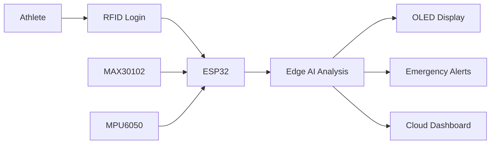

<div align="center">

# 🏋️‍♂️ AI-Powered Workout Intensity & Injury Risk Predictor


---

### 🚀 RushHour 2026 National Hackathon Project

*"Preventing injuries before they happen through Intelligent Edge AI."*

</div>

---

# 📌 About The Project

Modern fitness wearables primarily count **steps**, **calories**, and **heart rate**, but they fail to detect **real-time injury risks** during intense workouts.

Our solution is an **IoT-enabled Edge Safety Ecosystem** powered by an **ESP32**, capable of monitoring an athlete's body movement, cardiovascular status, and emergency conditions in real time.

The system continuously analyzes motion and physiological data to predict dangerous workout situations before they become severe injuries.

---

# ❗ Problem Statement

> **In high-intensity weightlifting and athletic training, existing fitness wearables fail to detect real-time acute biomechanical injury risks, cardiovascular redlines, and post-fall unconsciousness—leading to unmonitored athletic collapse and delayed emergency response.**

## Key Challenges

🔴 **Biomechanical Failure Detection**

- Cannot identify dangerous body sway
- Cannot detect poor lifting posture
- Unable to recognize excessive G-force or sudden jerks

🔴 **Cardiovascular Risk**

- Heart rate updates are too slow
- No instant warning during intense lifting
- Cannot detect dangerous cardiovascular strain

🔴 **Emergency Response**

- No automatic localized emergency alert
- False alarms waste critical time
- No trainer-level override mechanism

---

# 💡 Our Solution

An **IoT Enabled Edge Safety Ecosystem** built around the **ESP32** that combines:

- 📈 Real-Time Heart Rate Monitoring
- 🏃 Motion Tracking
- ⚡ Injury Risk Prediction
- 🚨 Emergency Fall Detection
- 📡 Live Cloud Monitoring
- 📱 Web Dashboard
- 🔔 Instant Visual & Audio Alerts
- 🪪 RFID Authentication
- 🤖 AI-based Workout Analysis

---

# ✨ Features

✅ Live Heart Rate Monitoring

✅ Workout Intensity Tracking

✅ Injury Risk Prediction

✅ Dangerous Body Movement Detection

✅ Fall Detection

✅ Automatic Emergency Alert

✅ RFID User Authentication

✅ OLED Live Display

✅ ESP32 WiFi Cloud Upload

✅ Real-Time Dashboard

---

# 🛠 Hardware Used

| Component | Purpose |
|------------|----------|
| ESP32 | Main Controller |
| MAX30102 | Heart Rate & SpO2 Sensor |
| MPU6050 | Motion & Fall Detection |
| MFRC522 | RFID Authentication |
| OLED Display | Live Status Display |
| Buzzer | Emergency Alert |
| LEDs | Warning Indicators |

---

# 💻 Software Stack

- Arduino IDE
- ESP32 Framework
- HTML
- CSS
- JavaScript
- Firebase / Local Web Server
- GitHub

---

# ⚙ System Workflow

```text
Athlete
   │
   ▼
RFID Authentication
   │
   ▼
Workout Starts
   │
   ▼
ESP32 Reads Sensors
   │
   ├── MAX30102
   ├── MPU6050
   │
   ▼
Edge Processing
   │
   ▼
Risk Analysis
   │
   ├── Safe
   ├── Warning
   └── Emergency
   │
   ▼
OLED + LED + Buzzer Alerts
   │
   ▼
Cloud Dashboard
```

---

# 🧠 System Architecture



---

# 🚀 Innovation

Unlike conventional fitness bands, our system:

- Predicts injuries before they occur
- Detects dangerous workout posture
- Detects unconscious falls
- Performs Edge AI processing
- Sends real-time cloud updates
- Provides localized trainer alerts

---

# 📈 Future Scope

- AI Personal Trainer
- Automatic Workout Recommendations
- ECG Integration
- Smartwatch Version
- Mobile App
- Machine Learning Based Risk Prediction
- Hospital Emergency Integration

---

# 👥 Team MercX

| Name | Role |
|------|------|
| G. Giri | Team Leader |
| R.K.athish | Developer |
| Mohith Sai K | Developer |
| V. Dhashvanth | Developer |
| N. Johen Giovanni | Developer |
| B. Praveen Kumar | Developer |

---

# 🏆 Hackathon Details

**Event**

RushHour 2026 National Engineering Challenge

**Institution**

Meenakshi Sundararajan Engineering College

**Venue**

Sathyabama Institute of Science and Technology

---

# 📊 Project Status

🟢 Prototype Completed

🟢 Hardware Integrated

🟢 Cloud Dashboard Connected

🟢 Ready for Demonstration

---
# ❤️ Vision

> **"Every lift should be stronger—not riskier."**

Our mission is to redefine workout safety using **AI**, **IoT**, and **Edge Computing**, ensuring athletes train smarter, safer, and stronger.

---

<div align="center">

### ⭐ If you like our project, give it a Star ⭐

Made with ❤️ by **Team MERCX**

</div>
